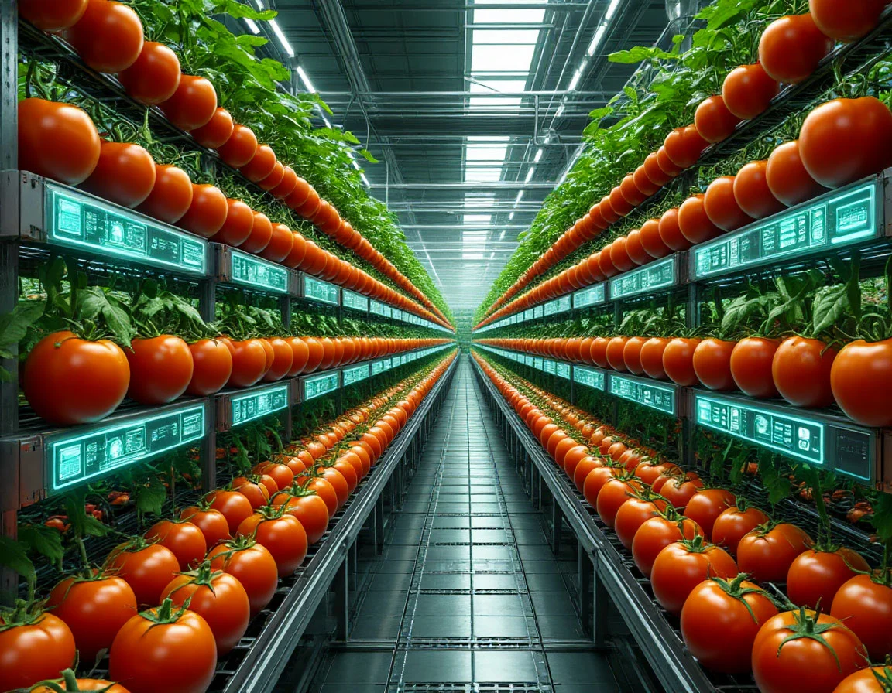

# Кибериммунный сельскохозяйственный комплекс по выращиванию помидоров


Этот проект представляет собой создание модели системы с применением киберимунного подхода.

## Постановка задачи
- Компания создает киберимунный агрокомплекс для автоматизированного выращивания томатов в условиях закрытого грунта. Комплекс должен функционировать с минимальным участием человека, обеспечивая полный цикл выращивания - от посадки семян до сбора урожая - за счет сенсорного контроля окружающей среды. 
- При этом агрокомплекс работает в среде с высокой биологической чувствительностью: малейшие отклонения в параметрах температуры, влажности, освещённости или состава питательной среды могут повлиять на урожай. Кроме того, система должна быть защищена от кибератак, так как внешнее вмешательство может привести к потере данных, изменению режимов работы или заражению растений и окружающей среды. 
- Поэтому требуется централизованная система управления с самодиагностикой, автоматическое отслеживание критических параметров среды и механизм быстрого реагирования на возникающие отклонения.

## Общая схема системы


## Отчет
см. [Отчет](docs/report.md)

## Запуск системы
```bash
cd deploy
docker compose up -d
```
В строке браузера ввести ```http://localhost:8080/swagger```. Используя графичекий интерфейс, начать процесс выращивания вводя Id параметров в REST API методе /grow.
Тествые параметры выращивания:
```json
[
  {
    "Id": "df30dbec-e088-4a62-a788-a023ed744029",
    "LightIntensity": 35,
    "LightDuration": 14,
    "AirTemperature": 25,
    "WaterTemperature": 23,
    "HumidityLevel": 80,
    "SoilHumidity": 65,
    "FertilizerConcentrationPpm": 30,
    "MinGrowthSeconds": 180
  },
  {
    "Id": "629a58d6-1c63-4b19-b15d-4e131cb48f4b",
    "LightIntensity": 40,
    "LightDuration": 12,
    "AirTemperature": 38,
    "WaterTemperature": 20,
    "HumidityLevel": 60,
    "SoilHumidity": 73,
    "FertilizerConcentrationPpm": 55,
    "MinGrowthSeconds": 120
  },
  {
    "Id": "0e8d8080-fa13-4448-b134-472c6101387c",
    "LightIntensity": 67,
    "LightDuration": 18,
    "AirTemperature": 30,
    "WaterTemperature": 38,
    "HumidityLevel": 55,
    "SoilHumidity": 64,
    "FertilizerConcentrationPpm": 66,
    "MinGrowthSeconds": 60
  }
]
````