# Отчёт о выполнении задачи "Киберимунный сельскохозяйственный комплекс по выращиванию помидоров"
- [Отчёт о выполнении задачи "Киберимунный сельскохозяйственный комплекс по выращиванию помидоров"](#отчёт-о-выполнении-задачи-name)
  - [Постановка задачи](#постановка-задачи)
    - [Ценности, ущербы и неприемлемые события](#ценности-ущербы-и-неприемлемые-события)
  - [Известные ограничения и вводные условия](#известные-ограничения-и-вводные-условия)
    - [Цели и Предположения Безопасности (ЦПБ)](#цели-и-предположения-безопасности-цпб)
  - [Архитектура системы](#архитектура-системы)
    - [Контекст работы системы](#контекст-работы-системы)
    - [Общая архитектура системы](#общая-архитектура-системы)
    - [Базовый сценарий работы системы](#базовый-сценарий-работы-системы)
    - [Архитектура теплицы](#архитектура-теплицы)
    - [Базовый сценарий работы теплицы](#базовый-сценарий-работы-теплицы)
    - [Компоненты теплицы](#компоненты-теплицы)
  - [Описание Сценариев (последовательности выполнения операций), при которых ЦБ нарушаются](#описание-сценариев-последовательности-выполнения-операций-при-которых-цб-нарушаются)
    - [Негативыне сценарии](#негативыне-сценарии)
    - [НС-1](#негативный-сценарий---нс-1)
    - [НС-2](#негативный-сценарий---нс-2)
    - [НС-3](#негативный-сценарий---нс-3)
    - [НС-4](#негативный-сценарий---нс-4)
    - [НС-5](#негативный-сценарий---нс-5)
    - [НС-6](#негативный-сценарий---нс-6)
    - [НС-7](#негативный-сценарий---нс-7)
    - [НС-8](#негативный-сценарий---нс-8)
  - [Политика архитектуры](#политика-архитектуры)
    - [Изначальная архитектура](#изначальная-архитектура)
    - [Оценка сложности модулей](#оценка-сложности-модулей)
    - [Декомпозиция архитектуры](#декомпозиция-архитектуры)
    - [Описание модулей декомпозированной архитектуры](#описание-модулей-декомпозированной-архитектуры)
    - [Схема доверенных модулей](#схема-доверенных-модулей)
  - [Проверка негативных сценариев](#проверка-негативных-сценариев)
    - [Проверка негативного сценария - ПНС-1](#проверка-негативного-сценария---пнс-1)
    - [Проверка негативного сценария - ПНС-2](#проверка-негативного-сценария---пнс-2)


## Постановка задачи
- Компания создает киберимунный агрокомплекс для автоматизированного выращивания томатов в условиях закрытого грунта. Комплекс должен функционировать с минимальным участием человека, обеспечивая полный цикл выращивания - от посадки семян до сбора урожая - за счет сенсорного контроля окружающей среды. 
- При этом агрокомплекс работает в среде с высокой биологической чувствительностью: малейшие отклонения в параметрах температуры, влажности, освещённости или состава питательной среды могут повлиять на урожай. Кроме того, система должна быть защищена от кибератак, так как внешнее вмешательство может привести к потере данных, изменению режимов работы или заражению растений вредителями через сбой в биозащите. 
- Поэтому требуется централизованная система управления с самодиагностикой, автоматическое отслеживание критических параметров среды и механизм быстрого реагирования на возникающие отклонения

### Ценности, ущербы и неприемлемые события

|Ценность|Негативное событие|Оценка ущерба|Комментарий|
|:-:|:-:|:-:|:-:|
|Люди|Автоматизированная техника или используемые химикаты причинили вред сотруднику|Высокий|Ответственность компании, судебные разбирательства|
|Растения|Вредоносное вмешательство привело к уничтожению урожая|Высокий|Потери продукции, финансовые убытки|  
|Окружающая среда|Сбой в системе контроля привёл к выбросу вредных веществ|Высокий|Экологические последствия, штрафы|  
|Данные агрокомплекса|Нарушение целостности данных привело к неверным решениям по уходу|Средний|Снижение урожайности, дополнительные затраты|  
|Данные агрокомплекса|Утечка данных о параметрах системы|Высокий|Конкурентные риски, возможность кибератак|
|Инфраструктура|Сбой в системе привёл к аварии (пожар, затопление и т. д.)|Высокий|Разрушение имущества, угроза жизни сотрудников|

## Известные ограничения и вводные условия
- Используется микросервисная архитектура и брокер сообщений для реализации асинхронной работы сервисов.
- Между собой сервисы общаются через брокер сообщений, а все внешнее взаимодействие происходит через REST API.
- Графический интерфейс для взаимодействия с пользователем не требуется, достаточно примеров REST запросов.

### Цели и Предположения Безопасности (ЦПБ)
Цели безопасности:
1. Выполняются только аутентичные задания на выращивание.
2. Нарушение процесса выращивания не должно приводить к заражению почвы.
3. При любых обстоятельствах параметры окружающей среды остаются в безопасных пределах.
4. В любых обстоятельствах оборудование и процессы выращивания не должены причинять вред сотрудникам.

Предположения безопасности:
1. Только авторизованные сотрудники управляют системами.
2. Агрономов учавствующих в посадке семян и сборки урожая считать благонадежными.
3. База параметров выращивания не содержит опасные параметры окружающей среды.
4. Все поставщики расходных материалов(семена/удобрения/почва/пестицицы и т.п.) благонадежны, что исключает возможность изначальной порчи или заражения расходных материалов.
5. Оборудование защищено от повреждения из-за неправильного управления.
6. Монитор безопасности и брокер сообщений доверенные модули.
7. Опыление растений происходит естественным путем, реализация искусственного опыления не требуется.
8. База данных сортов и параметров их выращивания считаем доверенным внешним модулем, составленным компитентными специалистами.

## Архитектура системы
### Контекст работы системы
- Агроном-оператор и теплицы взаимодействуют с базой данных параметров, необходимых для выращивания, помимо системы системы планирования выращивания.
- Система планирования выращивания знает какие теплицы на момент получения задания свободны и инициализирует процесс для конкретной теплицы с использованием идентификатором параметров выращивания.
- Система управления теплицей получает по идентификатору параметров выращивания необходимые семена и отправляет команды управления освещением, концентрацией удобрений, влажностью почвы и др. в соответствующие компоненты системы.
- Для посадки семян и сбора урожая используется персонал агрономов, специальные автоматы выдачи семян и конвейерные ленты для транспортировки урожая на склад.

### Общая архитектура системы
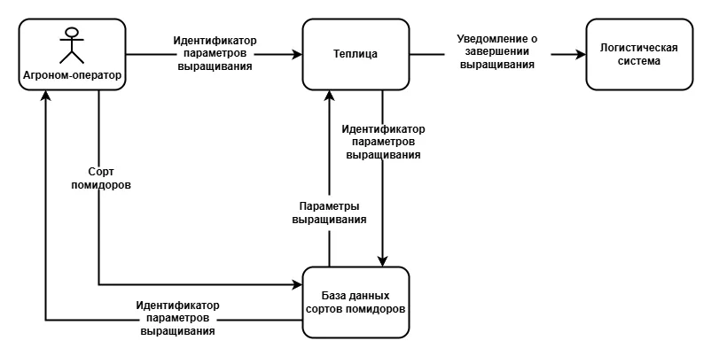

### Базовый сценарий работы системы
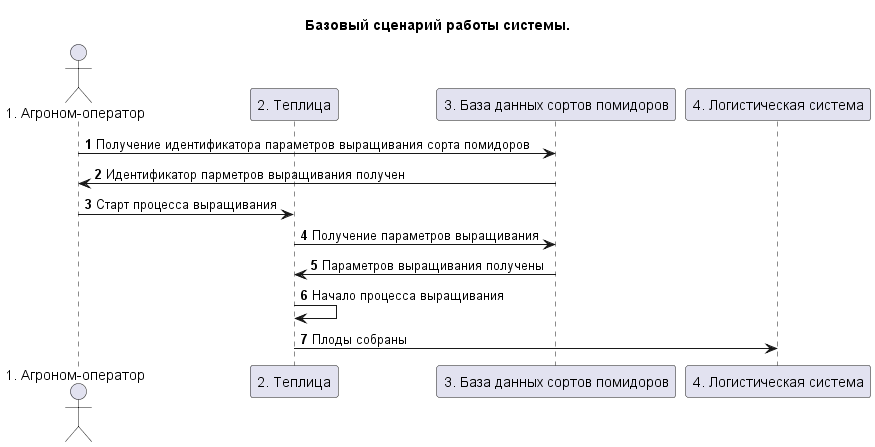

### Архитектура теплицы
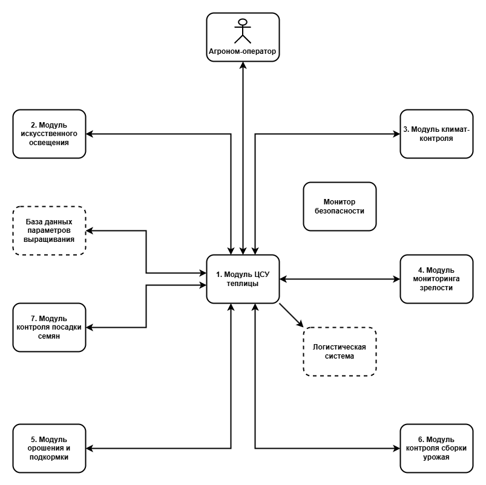

### Базовый сценарий работы теплицы
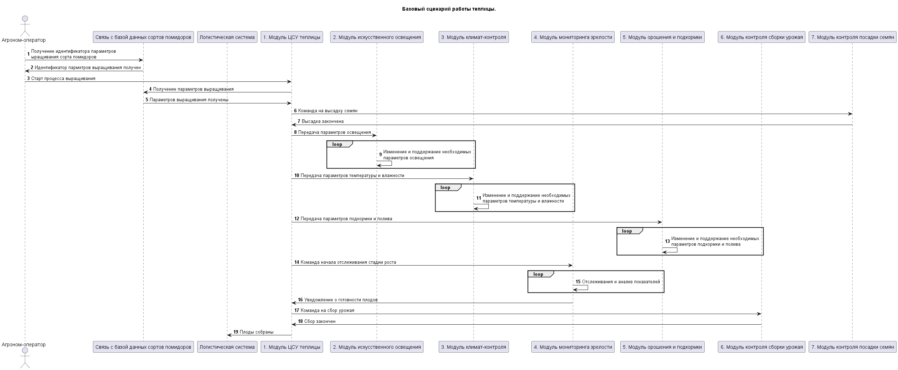

### Компоненты теплицы
|Компонент|Назначение|
|:--|:--|
|1. Модуль центральеной системы управления теплицы (модуль ЦСУ теплицы) | Осуществляет отправку команд остальным модулям, а также взаимодействует с вешними системами |
|2. Модуль искусственного освещения | Регулирует световой режим в теплице |
|3. Модуль климат-контроля | Регулирует параметры влажности и температуры воздуха|
|4. Модуль мониторинга зрелости | Анализирует данные с камер для оценки зрелости плода, а также учитывает необходимый временной отрезок времени для выращивания |
|5. Модуль орошения и подкормки | Отвечает за правильную концентрацию удобрений и поддержание надлежащего уровеня температуры, влажности и других показателей почвы |
|6. Модуль контроля сборки урожая | Система подтверждения начала и конца ручной сборки урожая |
|7. Модуль контроля посадки семян | Система подтверждения начала и конца ручной высадки необходимых семян |

## Описание Сценариев (последовательности выполнения операций), при которых ЦБ нарушаются
Напоминание ЦБ:
1. Выполняются только аутентичные задания на выращивание.
2. Нарушение процесса выращивания не должно приводить к заражению почвы.
3. При любых обстоятельствах параметры окружающей среды остаются в безопасных пределах.
4. В любых обстоятельствах оборудование и процессы выращивания не должены причинять вред сотрудникам.

|Атакованный модуль |ЦБ1|ЦБ2|ЦБ3|ЦБ4|Кол-во нарушений|
|:--|:-:|:-:|:-:|:-:|:-:|
|1. ЦСУ теплицы |🔴|🔴|🔴|🔴|4/4|
|2. Искусственное освещение |🟢|🟢|🔴|🔴|4/4|
|3. Климат-контроль |🟢|🟢|🔴|🔴|2/4|
|4. Мониторинг зрелости |🔴|🔴|🟢|🟢|2/4|
|5. Орошение и подкормка |🟢|🔴|🔴|🔴|3/4|
|7. Контроля сборки урожая|🟢|🔴|🟢|🔴|2/4|
|8. Контроля посадки семян|🟢|🟢|🟢|🔴|1/4|

🟢 - ЦБ не нарушена 🔴 - ЦБ нарушена

### Негативыне сценарии
|Название сценария|Описание|
|---|----------------------|
|[НС-1](#негативный-сценарий---нс-1)| **Модуль центральной системы управления теплицей** отправил команду о сборе урожая до его готовности, что привело к нарушению ЦБ 1, 4 |
|[НС-2](#негативный-сценарий---нс-2)| **Модуль центральной системы управления теплицей** получил параметры окружающей среды, но сорт семян был изменен при передачи параметров, что привело к нарушению ЦБ 1 |
|[НС-3](#негативный-сценарий---нс-3)| **Модуль искусственного освещения** получил необходимые параметры освещения, но лампы искусственного освещения были включены на полную мощность, что привело к нарушению ЦБ 3, 4 |
|[НС-4](#негативный-сценарий---нс-4)| **Модуль климат-контроля** заменил значение температуры воздуха и обогреватели раскалили воздух, что привело к нарушению ЦБ 3, 4 |
|[НС-5](#негативный-сценарий---нс-5)| **Модуль системы орошения и подкормки** получил необходимые параметры полива и удобрения, но были изменены парметры концентрации удобрений, что привело к нарушению ЦБ 2, 3 |
|[НС-6](#негативный-сценарий---нс-6)| **Модуль системы орошения и подкормки** начал опрыскивание химикатами растений во время сборки или посадки растений, что привело к нарушению ЦБ 4 |
|[НС-7](#негативный-сценарий---нс-7)| **Модуль контроля сборки урожая** не инициализирует сборку урожая, что привело к нарушению ЦБ 1 |

### Негативный сценарий - НС-1:
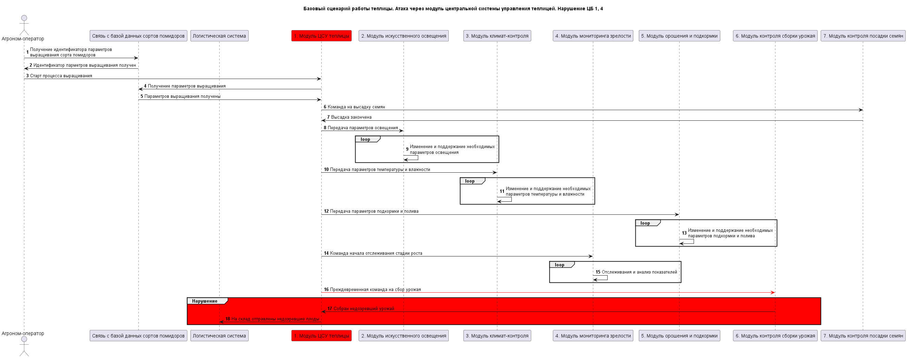
[Исходник диаграммы](schemes/ns/ns-1.wsd)

### Негативный сценарий - НС-2:
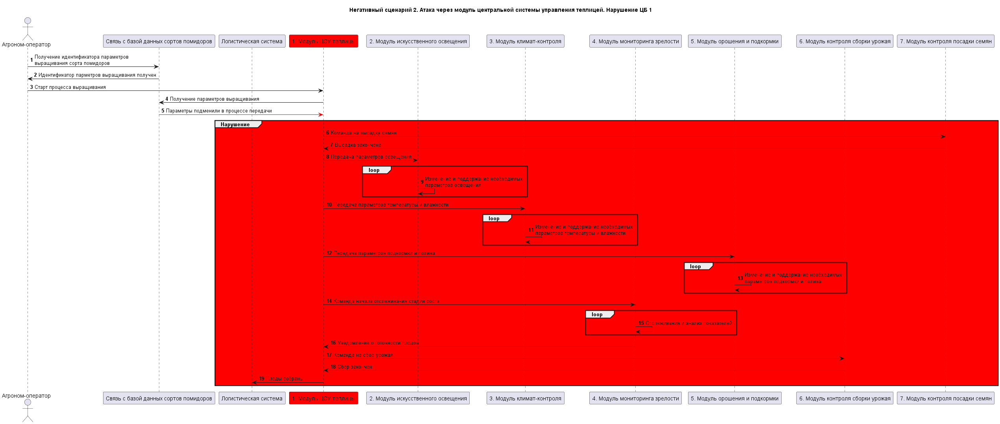
[Исходник диаграммы](schemes/ns/ns-2.wsd)

### Негативный сценарий - НС-3:
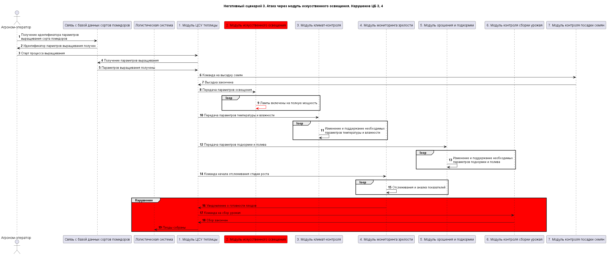
[Исходник диаграммы](schemes/ns/ns-3.wsd)

### Негативный сценарий - НС-4:
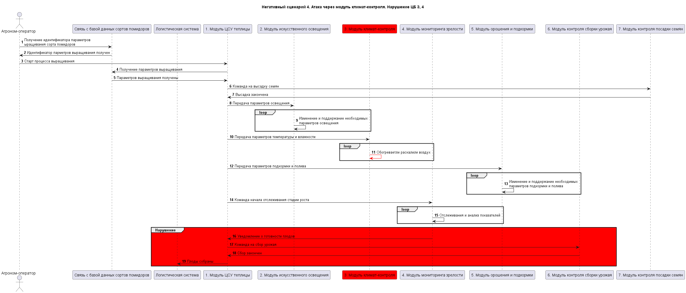
[Исходник диаграммы](schemes/ns/ns-4.wsd)

### Негативный сценарий - НС-5:
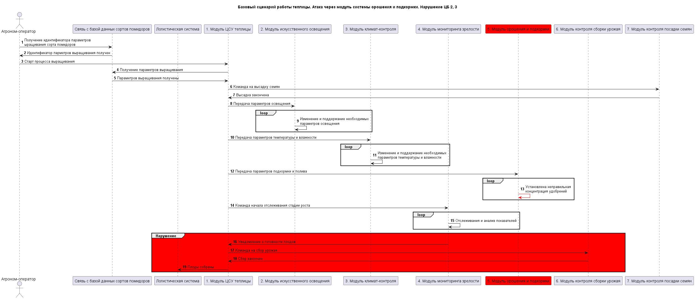
[Исходник диаграммы](schemes/ns/ns-5.wsd)

### Негативный сценарий - НС-6:
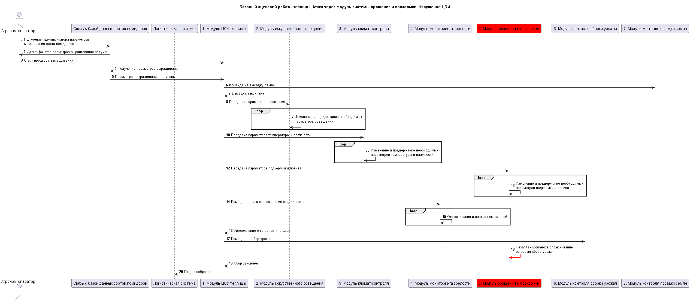
[Исходник диаграммы](schemes/ns/ns-6.wsd)

### Негативный сценарий - НС-7:
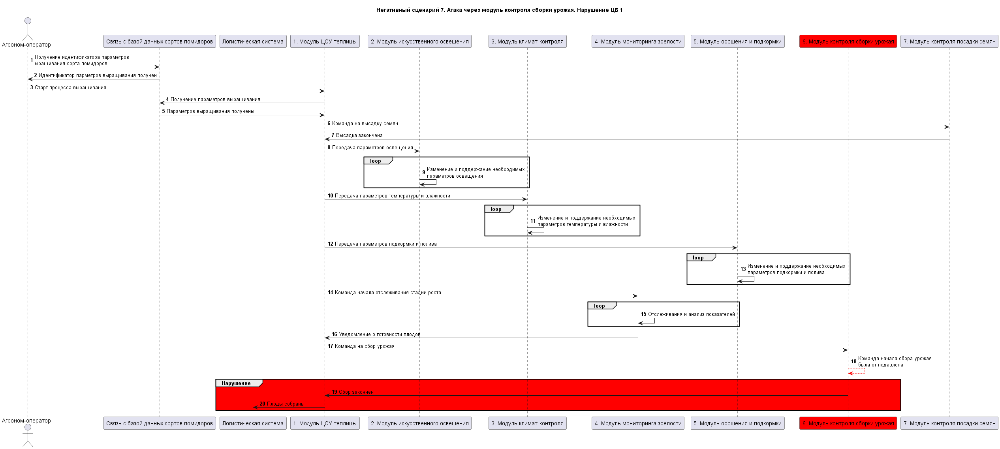
[Исходник диаграммы](schemes/ns/ns-7.wsd)

## Декомпозиция архитектуры


### Описание модулей декомпозированной архитектуры
| Модуль | Описание | Коментарий |
|:--|:--|:--|
| 1. Модуль ЦСУ теплицы | Отправлка команд параметров в системы контроля | Выделен отдельный модуль контроля цикла выращивания |
| 2. Модуль контроля искусственного освещения | Цикл проверки параметров освещения | Модуль содержит основной цикл проверки текущих параметров освещения, и отправляет команды на лампы искусственного освещения в случае отклонения от нормы |
| 3. Модуль отслеживания климат-контроля | Цикл проверки параметров климат-контроля | Модуль содержит основной цикл проверки текущих параметров температуры и влажности воздуха. Отправляет команды на устройства нагрева-охлаждения и увлажнители в случае отклонения от нормы |
| 4. Модуль мониторинга зрелости | Цикл проверки стадии роста по поступающим данным | Модуль содержит основной цикл проверки поступающих из **модулей 12 и 14** данных, сравнивая данные делает выводы о готовности плодов |
| 5. Модуль контроля орошения и подкормки | Цикл проверки параметров орошения и подкормки | Модуль содержит основной цикл проверки текущих параметров влажности почвы и концентрации поступающих удобрений |
| 6. Модуль контроля сборки урожая | Без изменений | Изначальный модуль не содердит в себе сложной логики и большого кол-ва кода, в докомпозиции не нуждается |
| 7. Модуль контроля посадки семян | Без изменений | Изначальный модуль не содердит в себе сложной логики и большого кол-ва кода, в докомпозиции не нуждается |
| 8. Модуль проверки подписи данных | Проверка подписи данных | Модуль проверяет подписи, поступающих из базы данных параметров |
| 9. Модуль фильтрации показателей датчиков освещения | Фильтр среднего по нескольким источникам данных | Простой фильтр, фиксирующий резкие скачки показаний датчиков |
| 10. Модуль фильтрации показателей влажности воздуха  | Фильтр по нескольким источникам данных | Простой фильтр, фиксирующий резкие скачки показаний датчиков |
| 11. Модуль фильтрации показателей температуры воздуха | Фильтр по нескольким источникам данных | Простой фильтр, фиксирующий резкие скачки показаний датчиков |
| 12. Модуль фильтрации показателей температуры воды | Фильтр по нескольким источникам данных | Простой фильтр, фиксирующий резкие скачки показаний датчиков |
| 13. Модуль визуальной проверки плодов | Получение и анализ зрелости плодов по данным с камер | Принимает изображения с камер и принимает решение о готовности урожая |
| 14. Модуль контроля времени роста | Отсчет времени роста | Проверяет время роста плодов со статистическим временем роста |
| 15. Модуль фильтрации показателей влажности почвы | Фильтр по нескольким источникам данных | Простой фильтр, фиксирующий резкие скачки показаний датчиков |
| 16. Модуль контроля питательного состава | Управление свешиванием и подачей удобрения | Отправляет команды смешивания и добавления удобрения в замешиваемый состав при получении соответствующей команды от **модуля 5**|
| 17. Модуль контроля цикла выращивания | Цикл выращивания | Выделенный из **модуля 1** отдельный компонент, отвечающий за отслеживание текущего этапа выращивания, а также отправки команд сбора или высадки |
| 18. Модуль аварийной остановки выращивания | Аварийная остановка выращивания | Отключает питание систем в теплице |

### Базовый сценарий декомпозированной архитектуры
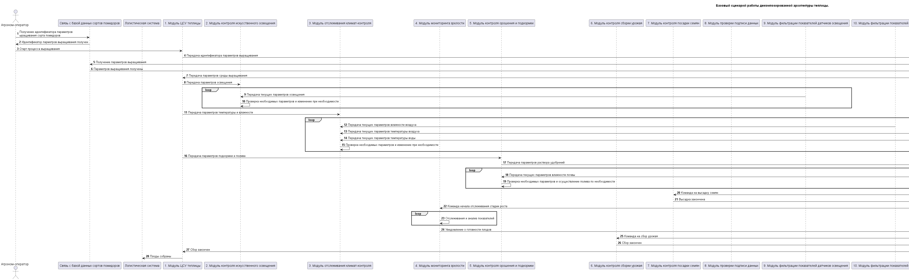
[Исходник диаграммы](schemes/greenhouse-decomposed-proccessing-scheme.wsd)

### Политика архитектуры


### Качественные оценки доменов
| Сложность || Размер (объем) кода||
|:--|:--:|:--|:--:|
| S (simple) | простой | S | маленький |
| M (medium) | средней сложности | M | среднего размер |
| C (complex) | сложный | L | большой |
||| XL | очень большой |

**SS - простой и маленький**

### Обоснование уровня доверия модулей
| Модуль | Уровень доверия | Обоснование | Коментарий |
|:--|:--|:--|:--|
| 1. Модуль ЦСУ теплицы | Недоверенный | | **Модули 2,3,5** проверят данные. **Модуль 17** не будет реагировать на команды ЦСУ |
| 2. Модуль контроля искусственного освещения | Доверенный | Нарушение ЦБ 3, 4 | Может установить опасные параметры освещения, ослепить сотрудника |
| 3. Модуль отслеживания климат-контроля | Доверенный | Нарушение ЦБ 3, 4 | Может установить опасные параметры климата, повысить темпиратуру воздуха до критического значения, причиняя вред сотруднику |
| 4. Модуль мониторинга зрелости | Доверенный | Нарушение ЦБ 1, 2 | Может оповестить систему о готовности плодов до их фактического созревания |
| 5. Модуль контроля орошения и подкормки | Доверенный | Нарушение ЦБ 2, 3, 4 | Может изменить концентрацию раствора удобрений и заразить почву |
| 6. Модуль контроля сборки урожая | Доверенный | Нарушение ЦБ 1, 2 | Может не оповестить мимтему о сболрке урожая до их фактического созревания |
| 7. Модуль контроля посадки семян | Доверенный | Нарушение ЦБ 4 | Может инициировать процесс посадки семян во время полива растений химикатами |
| 8. Модуль проверки подписи данных | Доверенный | Нарушение ЦБ 1, 2, 3, 4 | Может заменить данные параметров выращивания |
| 9. Модуль фильтрации показателей датчиков освещения | Недоверенный | | **Модуль 2** проверит данные |
| 10. Модуль фильтрации показателей влажности воздуха  | Недоверенный | | **Модуль 3** проверит данные |
| 11. Модуль фильтрации показателей температуры воздуха | Недоверенный | | **Модуль 3** проверит данные |
| 12. Модуль фильтрации показателей температуры воды | Недоверенный | | **Модуль 3** проверит данные |
| 13. Модуль визуальной проверки плодов | Недоверенный | | **Модуль 4** проверит данные |
| 14. Модуль контроля времени роста | Доверенный | Нарушение ЦБ 1, 2 | Может сработать раньше минимального времени роста растений |
| 15. Модуль фильтрации показателей влажности почвы | Недоверенный | | **Модуль 5** проверит данные |
| 16. Модуль контроля питательного состава | Доверенный | Нарушение ЦБ 2, 3, 4 | Может менять состав и концентрацию удобрений и химикатов |
| 17. Модуль контроля цикла выращивания | Доверенный | Нарушение ЦБ 1, 2, 3, 4 | Может менять порядок цикла выращивания, менять парметры выращивания |
| 18. Модуль аварийной остановки выращивания | Доверенный | Содержит необходимые действия для предотвращения дальнейших разрушительных действий системы при неудачных попытках стабилизации | Отключение систем, при неудачных попытках |

### Проверка негативных сценариев
|Название сценария|Описание|
|---|---------|
|НС-1|Тест Негативного сценария 1. **Модуль центральной системы управления теплицей** скомпрометирован и пытается отправлять команды **модулю контроля цикла выращивания**, но модуль уже начал ожидание завершения выращивания и игнорирует команды, ЦБ не нарушены|
|НС-2|Тест Негативного сценария 2. **Модуль центральной системы управления теплицей** скомпрометирован, но за выбор сорта семян отвечает **модуль контроля цикла выращивания**, ЦБ не нарушены|
|НС-3|Тест Негативного сценария 3, 4, 5, 6. При компрометации модулей в этих сценариях, **модуль аварийной остановки выращивания** отключает питание модулей, ЦБ  не нарушены |
|НС-4|Тест Негативного сценария 4, 6, 8, 10. **Модуль контроля сборки урожая** скомпрометирован и не инициирует отправку команды для сбора урожая, но модуль **Модуль контроля цикла выращивания** отслеживает время сбора и инициирует аварийное завершение выращивания, ЦБ не нарушены|

### Проверка негативного сценария - ПНС-1
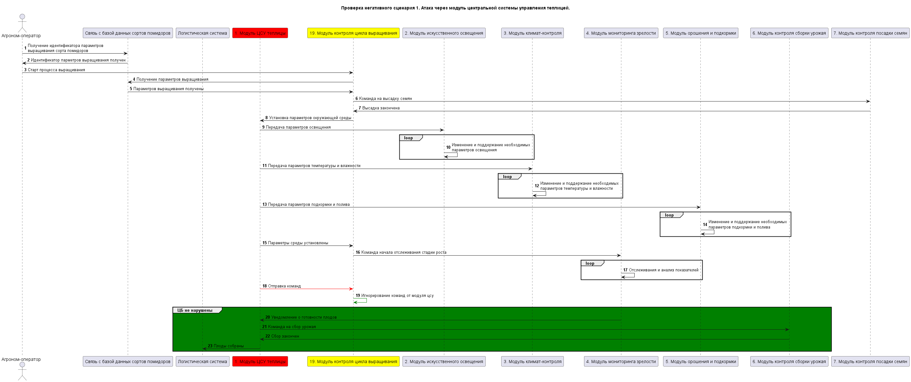
[Исходник диаграммы](schemes/pns/pns-1.wsd)

### Проверка негативного сценария - ПНС-2
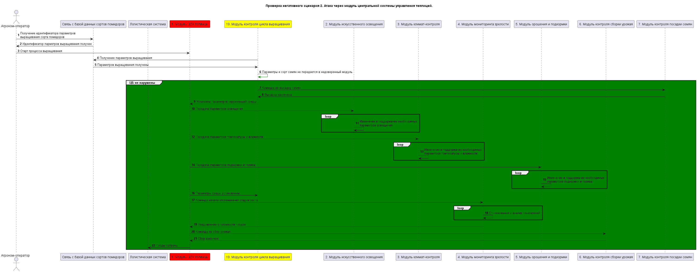
[Исходник диаграммы](schemes/pns/pns-2.wsd)

### Политики монитора безопасности
```C#
// Form MainControlModule
if (monitorHeaders.AuthorizeAction(
    actionName: nameof(StartGrowingCycleCommand),
    sourceModule: ModuleNames.MainControl,
    destinationModule: ModuleNames.GrowingCycleControlModule))
    authorizeAction = true;

if (monitorHeaders.AuthorizeAction(
    actionName: nameof(SetLightingLevelCommand),
    sourceModule: ModuleNames.MainControl,
    destinationModule: ModuleNames.LightingControl))
    authorizeAction = true;

if (monitorHeaders.AuthorizeAction(
    actionName: nameof(SetClimateParamsCommand),
    sourceModule: ModuleNames.MainControl,
    destinationModule: ModuleNames.ClimateControl))
    authorizeAction = true;

if (monitorHeaders.AuthorizeAction(
    actionName: nameof(SetIrrigationParamsCommand),
    sourceModule: ModuleNames.MainControl,
    destinationModule: ModuleNames.IrrigationControl))
    authorizeAction = true;

// From GrowingCycleControlModule
if (monitorHeaders.AuthorizeAction(
    actionName: nameof(GetPlantGrowingParamsCommand),
    sourceModule: ModuleNames.GrowingCycleControlModule,
    destinationModule: ModuleNames.PlantDataSignatureChecker))
    authorizeAction = true;

if (monitorHeaders.AuthorizeAction(
    actionName: nameof(SetupAllControlModulesCommand),
    sourceModule: ModuleNames.GrowingCycleControlModule,
    destinationModule: ModuleNames.MainControl))
    authorizeAction = true;

if (monitorHeaders.AuthorizeAction(
    actionName: nameof(StartPlantingCommand),
    sourceModule: ModuleNames.GrowingCycleControlModule,
    destinationModule: ModuleNames.PlantingModule))
    authorizeAction = true;

if (monitorHeaders.AuthorizeAction(
    actionName: nameof(StartMaturityMonitoringCommand),
    sourceModule: ModuleNames.GrowingCycleControlModule,
    destinationModule: ModuleNames.MaturityMonitoringControl))
    authorizeAction = true;

if (monitorHeaders.AuthorizeAction(
    actionName: nameof(StartHarvestingCommand),
    sourceModule: ModuleNames.GrowingCycleControlModule,
    destinationModule: ModuleNames.HarvestingModule))
    authorizeAction = true;

if (monitorHeaders.AuthorizeAction(
    actionName: nameof(GrowingCompleteEvent),
    sourceModule: ModuleNames.GrowingCycleControlModule,
    destinationModule: ModuleNames.MainControl))
    authorizeAction = true;

// From PlantDataSignatureChecker
if (monitorHeaders.AuthorizeAction(
    actionName: nameof(ReceivedPlantGrowingParamsEvent),
    sourceModule: ModuleNames.PlantDataSignatureChecker,
    destinationModule: ModuleNames.GrowingCycleControlModule))
    authorizeAction = true;

// From LightingControl
if (monitorHeaders.AuthorizeAction(
    actionName: nameof(LightingLevelEvent),
    sourceModule: ModuleNames.LightSensorFilter,
    destinationModule: ModuleNames.LightingControl))
    authorizeAction = true;

// From ClimateControlModule
if (monitorHeaders.AuthorizeAction(
    actionName: nameof(AirHumidityEvent),
    sourceModule: ModuleNames.AirHumiditySensorFilter,
    destinationModule: ModuleNames.ClimateControl))
    authorizeAction = true;

if (monitorHeaders.AuthorizeAction(
    actionName: nameof(AirTemperatureEvent),
    sourceModule: ModuleNames.AirTermoSensorFilter,
    destinationModule: ModuleNames.ClimateControl))
    authorizeAction = true;

if (monitorHeaders.AuthorizeAction(
    actionName: nameof(WaterTemperatureEvent),
    sourceModule: ModuleNames.WaterTermoSensorFilter,
    destinationModule: ModuleNames.ClimateControl))
    authorizeAction = true;

// From Irrigation
if (monitorHeaders.AuthorizeAction(
    actionName: nameof(FertilizerPreparationCommand),
    sourceModule: ModuleNames.IrrigationControl,
    destinationModule: ModuleNames.NutrientCompositionControl))
    authorizeAction = true;

if (monitorHeaders.AuthorizeAction(
    actionName: nameof(FertilizerPreparationCompleteEvent),
    sourceModule: ModuleNames.NutrientCompositionControl,
    destinationModule: ModuleNames.IrrigationControl))
    authorizeAction = true;

if (monitorHeaders.AuthorizeAction(
    actionName: nameof(SoilHumidityEvent),
    sourceModule: ModuleNames.SoilHumiditySensorFilter,
    destinationModule: ModuleNames.IrrigationControl))
    authorizeAction = true;

// From MaturityMonitoring
if (monitorHeaders.AuthorizeAction(
    actionName: nameof(StartTimeControlCommand),
    sourceModule: ModuleNames.MaturityMonitoringControl,
    destinationModule: ModuleNames.TimeControl))
    authorizeAction = true;

if (monitorHeaders.AuthorizeAction(
    actionName: nameof(MinimalGrowthTimeTriggeredEvent),
    sourceModule: ModuleNames.TimeControl,
    destinationModule: ModuleNames.MaturityMonitoringControl))
    authorizeAction = true;

if (monitorHeaders.AuthorizeAction(
    actionName: nameof(VisualInspectionTriggeredEvent),
    sourceModule: ModuleNames.VisualInspection,
    destinationModule: ModuleNames.MaturityMonitoringControl))
    authorizeAction = true;

if (monitorHeaders.AuthorizeAction(
    actionName: nameof(MaturityCompletedEvent),
    sourceModule: ModuleNames.MaturityMonitoringControl,
    destinationModule: ModuleNames.GrowingCycleControlModule))
    authorizeAction = true;

// From Planting
if (monitorHeaders.AuthorizeAction(
    actionName: nameof(PlantingCompleteEvent),
    sourceModule: ModuleNames.PlantingModule,
    destinationModule: ModuleNames.GrowingCycleControlModule))
    authorizeAction = true;

// From Harvesting
if (monitorHeaders.AuthorizeAction(
    actionName: nameof(HarvestingCompleteEvent),
    sourceModule: ModuleNames.HarvestingModule,
    destinationModule: ModuleNames.GrowingCycleControlModule))
    authorizeAction = true;

// EmergencyStopModule
if (monitorHeaders.AuthorizeAction(
    actionName: nameof(AbordSystemCommand),
    sourceModule: ModuleNames.EmergencyStop,
    destinationModule: ModuleNames.MainControl))
    authorizeAction = true;

if (monitorHeaders.AuthorizeAction(
    actionName: nameof(AbordSystemCommand),
    sourceModule: ModuleNames.ClimateControl,
    destinationModule: ModuleNames.EmergencyStop))
    authorizeAction = true;

if (monitorHeaders.AuthorizeAction(
    actionName: nameof(AbordSystemCommand),
    sourceModule: ModuleNames.ClimateControl,
    destinationModule: ModuleNames.EmergencyStop))
    authorizeAction = true;

if (monitorHeaders.AuthorizeAction(
    actionName: nameof(AbordSystemCommand),
    sourceModule: ModuleNames.ClimateControl,
    destinationModule: ModuleNames.EmergencyStop))
    authorizeAction = true;

if (monitorHeaders.AuthorizeAction(
    actionName: nameof(AbordSystemCommand),
    sourceModule: ModuleNames.ClimateControl,
    destinationModule: ModuleNames.EmergencyStop))
    authorizeAction = true;
```

### Запуск теста негативного сценария
```bash
cd deploy
docker compose -f docker-compose.test.ns1.yml up -d
```